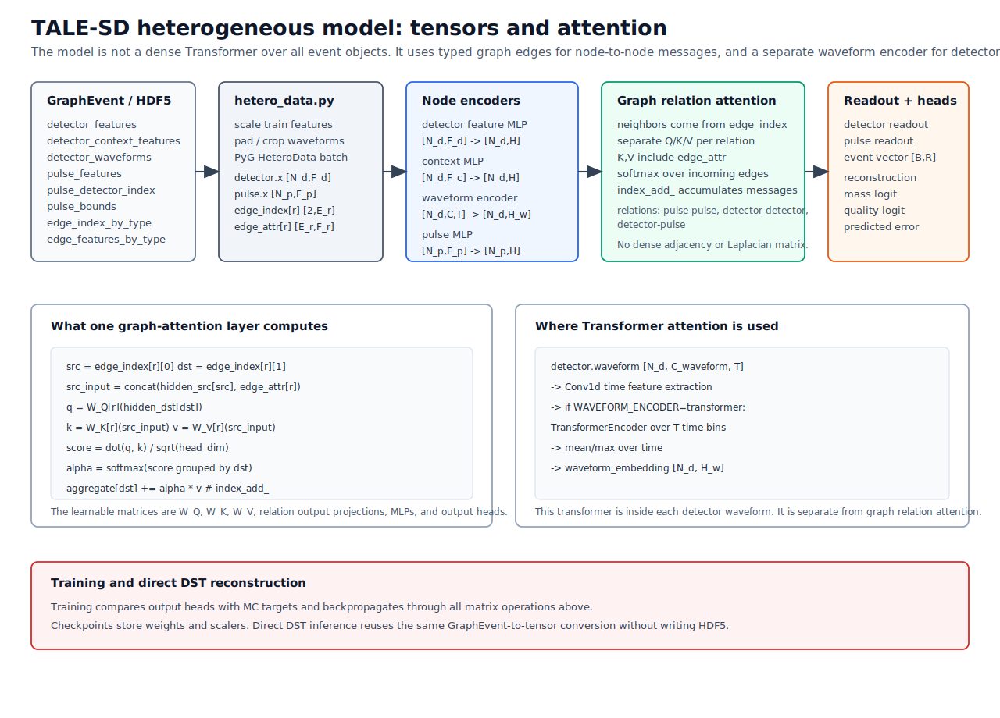

Heterogeneous model explained
=============================

This page explains the current TALE-SD heterogeneous model from input arrays to
output predictions.
It follows the teaching style of the official
`PyTorch Dataset/DataLoader tutorial <https://docs.pytorch.org/tutorials/beginner/basics/data_tutorial.html>`_,
the official
`PyTorch training tutorial <https://docs.pytorch.org/tutorials/beginner/introyt/trainingyt.html>`_,
and the official
`PyG heterogeneous graph guide <https://pytorch-geometric.readthedocs.io/en/stable/notes/heterogeneous.html>`_:
first define the data object, then define the model, then show how training and
inference use the same inputs.

The code paths described here are the actual code paths used by the repository:

.. list-table::
   :header-rows: 1

   * - Step
     - Implementation
   * - HDF5 sample read/write
     - ``talesd_gnn_reconstruction.hetero_graph_io``
   * - Tensor / PyG conversion
     - ``talesd_gnn_reconstruction.hetero_data``
   * - Model
     - ``talesd_gnn_reconstruction.hetero_model.MinimalHeteroTaleSdGNN``
   * - Training
     - ``talesd_gnn_reconstruction.hetero_training.train_hetero_model``
   * - Direct DST inference
     - ``talesd_gnn_reconstruction.hetero_predict.reconstruct_dst``

Forward-pass overview
---------------------

   The model keeps a full event graph. Detector waveforms are stored once on
   detector nodes. Pulse nodes keep ``pulse_detector_index`` and
   ``pulse_bounds``. Relation attention updates detector and pulse states, and
   type-wise readout produces one event vector.

One event as a heterogeneous data object
----------------------------------------

PyG represents heterogeneous graphs with separate node stores and edge stores.
The TALE-SD graph uses the same idea. One event has two node types and three
relation types:

.. code-block:: text

   node types:
     detector
     pulse

   edge types:
     ("pulse", "interacts", "pulse")
     ("detector", "near", "detector")
     ("detector", "observes", "pulse")

The production training path keeps explicit tensors, and the optional PyG path
uses ``HeteroData``. This is the actual structure built by
``hetero_data.sample_to_hetero_data``:

.. code-block:: python

   data["detector"].x = tensors["detector"]["x"]
   data["detector"].context = tensors["detector"]["context"]
   data["detector"].pos = tensors["detector"]["pos"]
   data["detector"].lid = tensors["detector"]["lid"]
   data["detector"].waveform = tensors["detector"]["waveform"]

   data["pulse"].x = tensors["pulse"]["x"]
   data["pulse"].pos = tensors["pulse"]["pos"]
   data["pulse"].lid = tensors["pulse"]["lid"]
   data["pulse"].detector_index = tensors["pulse"]["detector_index"]
   data["pulse"].pulse_bounds = tensors["pulse"]["pulse_bounds"]

   data["pulse", "interacts", "pulse"].edge_index = ...
   data["pulse", "interacts", "pulse"].edge_attr = ...
   data["detector", "near", "detector"].edge_index = ...
   data["detector", "near", "detector"].edge_attr = ...
   data["detector", "observes", "pulse"].edge_index = ...
   data["detector", "observes", "pulse"].edge_attr = ...

This is not a single homogeneous feature matrix. Detector nodes and pulse nodes
carry different fields because they represent different physical objects.

Input fields
------------

``detector_features`` are detector-level signal, timing, and local geometry
features. ``detector_context_features`` are readout and calibration context.
Keeping them separate makes it possible to include, remove, or ablate context
without silently mixing it with shower features.

``detector_waveforms`` are full detector-level calibrated VEM waveforms. They
are not duplicated on pulse nodes. A pulse points back to its detector with
``pulse_detector_index`` and records the relevant time window through
``pulse_bounds``.

``pulse_features`` contain pulse timing, charge, core-relative coordinates when
the Ising reference core exists, and Ising annotations. Ising-rejected pulse
candidates are kept as input because delayed pulses, waveform tails, and
multi-pulse structure are physically relevant for mass and energy.

``edge_features_by_type`` stores continuous physical edge attributes. For
example, pulse-pulse edges include timing differences, spatial separation, and
Ising weights. These are not just labels; they are numerical inputs to the
attention calculation.

Conversion and scaling
----------------------

``hetero_sample_to_tensors`` converts NumPy arrays from HDF5 or direct DST
graphs into tensors. If scalers are supplied, detector, context, pulse, edge,
and target arrays are standardized using training-split statistics.

.. code-block:: python

   detector_features = _scale_tensor(
       detector_features,
       _scaler_for(scalers, "detector", "detector_features"),
   )
   detector_context = _scale_tensor(
       detector_context,
       _scaler_for(scalers, "detector_context", "detector_context_features"),
   )
   pulse_features = _scale_tensor(
       pulse_features,
       _scaler_for(scalers, "pulse", "pulse_features"),
   )
   edge_features_by_type[relation] = _scale_tensor(
       edge_features,
       _scaler_for(scalers, f"edge:{relation}", relation),
   )
   target_tensor = _scale_tensor(target_tensor, _scaler_for(scalers, "target"))

This mirrors the PyTorch Dataset/DataLoader separation: the dataset reads one
sample, the conversion layer turns it into tensors, and the training loop only
sees batched tensors.

Detector and pulse encoders
---------------------------

The model first embeds each detector and each pulse into a common hidden
dimension.

Detector nodes have three input branches:

.. code-block:: text

   detector_features        -> detector feature MLP
   detector_context_features -> detector context MLP
   detector_waveforms       -> waveform encoder
                         concat -> detector_node_encoder

Pulse nodes have one scalar branch:

.. code-block:: text

   pulse_features -> pulse_node_encoder

The waveform encoder is applied once per detector. For the first transformer
waveform sweep, the submitter sets ``WAVEFORM_ENCODER=transformer``. The graph
attention architecture remains ``hetero_attention``.

Relation attention
------------------

The core message-passing layer is ``HeteroAttentionMessageLayer``. For each
relation type, it builds separate query, key, and value projections:

.. code-block:: python

   src_input = torch.cat([src_state[src_index], edge_attr], dim=-1)
   query = self.query[relation](dst_state[dst_index]).view(-1, self.heads, self.head_dim)
   key = self.key[relation](src_input).view(-1, self.heads, self.head_dim)
   value = self.value[relation](src_input).view(-1, self.heads, self.head_dim)
   scores = (query * key).sum(dim=-1) * scale
   weights = _scatter_softmax(scores, dst_index, dst_state.shape[0])
   messages = (value * weights[:, :, None]).reshape(-1, self.hidden_dim)

The important TALE-specific point is that ``key`` and ``value`` include
``edge_attr``. This lets the model decide which neighboring pulse or detector
matters while seeing physical quantities such as ``dt_usec``, ``distance_km``,
``dt_per_km``, and ``ising_weight``.

After messages are accumulated, detector and pulse states are updated with a
residual connection, layer normalization, and a feed-forward block:

.. code-block:: text

   new_state = LayerNorm(old_state + update(old_state, aggregated_message))
   new_state = LayerNorm(new_state + FFN(new_state))

This is inspired by HGT, but it is not an exact HGT implementation. The current
model does not use PyG ``HGTConv`` and does not use HGSampling. Each TALE event
is one graph and is read as a whole.

Readout
-------

Training and inference need one prediction per event, not one prediction per
node. ``HeteroAttentiveReadout`` therefore pools detector nodes and pulse nodes
separately:

.. code-block:: text

   detector states -> mean, max, attention-weighted sums
   pulse states    -> mean, max, attention-weighted sums
   concat          -> event vector

This makes the readout type-aware. A detector and a pulse are not forced into
one shared pool before the model has summarized them.

Output heads
------------

The event vector is passed to task-specific heads:

.. list-table::
   :header-rows: 1

   * - Head
     - Output
     - Meaning
   * - Reconstruction
     - 6 values
     - ``log10_energy_eV``, ``core_x_km``, ``core_y_km``, ``dir_x``, ``dir_y``, ``dir_z``
   * - Mass
     - 1 logit
     - ``sigmoid(logit)`` gives iron probability
   * - Quality
     - 1 logit
     - auxiliary quality score
   * - Predicted error
     - 3 values
     - predicted energy, angular, and core uncertainties

The current comparison plan is not to enable every auxiliary head at once.
For the first transformer waveform sweep, run six jobs: three dataset sizes
times quality-only or predicted-error-only reco+mass.

Training
--------

``train_hetero_model`` follows the standard PyTorch training pattern:

.. code-block:: text

   H5HeteroGraphDataset
     -> split train / validation / test
     -> fit scalers on train split
     -> build model from first sample
     -> DataLoader batches HeteroData samples
     -> forward
     -> compute loss against MC target
     -> backward
     -> optimizer step
     -> save checkpoint and scalers

The checkpoint stores both model weights and the scalers. That is why direct
DST reconstruction can use the same feature normalization as training.

Direct DST reconstruction
-------------------------

Direct inference does not require HDF5. It uses the same graph schema and the
same model conversion:

.. code-block:: text

   DST
     -> dstio.tale.graph.iter_graphs
     -> graph_event_to_sample
     -> hetero_sample_to_tensors / HeteroData
     -> hetero_attention checkpoint
     -> reconstruction CSV

This is the final reconstruction path. HDF5 remains a training cache, not a
required intermediate file for production DST reconstruction.

Server command for the first transformer sweep
----------------------------------------------

After the balanced HDF5 files are ready, submit the first six transformer jobs
with:

.. code-block:: bash

   cd /dicos_ui_home/ikomae/work/src/talesd_gnn_reconstruction

   RUN_ID=hetero_balance_20260606_143020 \
   SUBMIT_EXPORTS=0 \
   SUBMIT_TRAINING=1 \
   MODEL_ARCHITECTURE=hetero_attention \
   WAVEFORM_ENCODER=transformer \
   PARTITION=v100-al9_long \
   scripts/submit_server_hetero_dataset_size_sweep.sh

This submits quality-only and predicted-error-only reco+mass training for the
50000, 20000, and 10000 events/bin datasets. The ``cnn-gru`` waveform encoder
should be compared later under the selected condition, not run as a simultaneous
six-job sweep at this stage.
