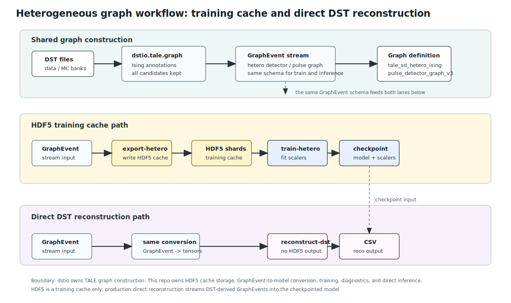
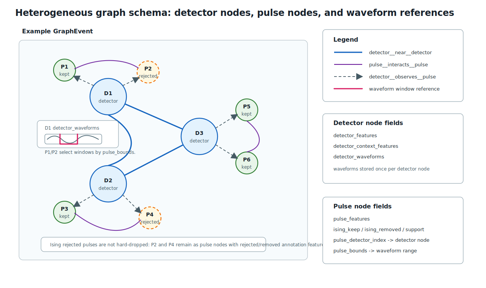

Heterogeneous DST Reconstruction Workflow
=========================================

The heterogeneous path is the current path for training a model that can later reconstruct DST files directly.
It uses ``dstio.tale.graph`` for graph semantics and keeps the GNN repository responsible for HDF5 training cache, model input conversion, training, diagnostics, and direct inference.

For the model internals, read :doc:`hetero_model`.
That page follows the PyTorch and PyG documentation style and explains the actual tensors, encoders, relation attention, readout, loss heads, and direct inference path used in this repository.

The first figure is the workflow diagram. It separates the HDF5 training-cache path from the direct DST reconstruction path.

   Detector waveforms are stored once on detector nodes. Pulse nodes keep ``pulse_detector_index`` and ``pulse_bounds`` so the model can relate each pulse to the detector waveform without duplicating that waveform.

Graph schema
------------

The second figure is the graph schema diagram. It shows the actual node and edge types used inside one ``GraphEvent``.
Detector nodes and pulse nodes are different node types.
Detector waveforms are stored on detector nodes once, and pulse nodes refer to a waveform segment using ``pulse_detector_index`` and ``pulse_bounds``.
Both Ising-kept and Ising-rejected pulse candidates remain present in the ML graph.

   Detector-detector, pulse-pulse, and detector-pulse relations are separate edge types. Ising-rejected pulse candidates are annotated and kept as input rather than hard-dropped.

``dstio.tale.graph.iter_graphs`` emits ``GraphEvent`` objects using
``tale_sd_hetero_ising_pulse_detector_graph_v1``.
The default ML graph policy is ``node_policy="all_candidates_with_ising"``:
Ising-rejected pulse candidates remain in the graph and carry Ising annotation features.
Use ``node_policy="ising_kept"`` only for reconstruction-cleaned subsets.

The node and relation types are:

.. list-table::
   :header-rows: 1

   * - Type
     - Stored fields
   * - Detector node
     - ``detector_features``, ``detector_context_features``, ``detector_positions_km``, ``detector_lids``, ``detector_waveforms``
   * - Pulse node
     - ``pulse_features``, ``pulse_positions_km``, ``pulse_lids``, ``pulse_detector_index``, ``pulse_bounds``
   * - Relations
     - ``pulse__interacts__pulse``, ``detector__near__detector``, ``detector__observes__pulse``

The core-relative pulse features are valid only when the Ising reference core exists.
Training export should therefore use ``--require-reference-core`` unless a separate diagnostic dataset is being made.

Training cache path
-------------------

``export-hetero`` writes HDF5 graph shards for repeated training reads.
This HDF5 is a cache, not the final reconstruction interface.

.. code-block:: text

   DST
     -> talesd-gnn export-hetero
       -> dstio.tale.graph.iter_graphs
         -> hetero_graph_io.py
           -> heterogeneous HDF5 shards

``train-hetero`` then reads those shards, fits scalers on the training split, trains the heterogeneous model, and saves a checkpoint.
The default model architecture is ``hetero_attention``: relation-specific multi-head attention over detector/pulse relations plus detector/pulse type-wise attention readout.
It does not use HGSampling; each TALE event remains a full event graph so detector, pulse, waveform, and Ising-rejected pulse information is not sampled away.
The first planned waveform-encoder comparison uses ``WAVEFORM_ENCODER=transformer`` for the six reco+mass size-sweep jobs; ``cnn-gru`` should be compared later under the selected condition.

Direct reconstruction path
--------------------------

``reconstruct-dst`` reads DST files directly and uses the same graph schema and checkpoint scalers as ``train-hetero``.
It does not write an intermediate HDF5 graph.

.. code-block:: text

   DST
     -> talesd-gnn reconstruct-dst
       -> dstio.tale.graph.iter_graphs
         -> hetero_data.sample_to_hetero_data
           -> hetero_attention checkpoint
             -> reconstruction CSV

The direct path is the intended path for large one-pass data and MC reconstruction after the heterogeneous model has been trained.
