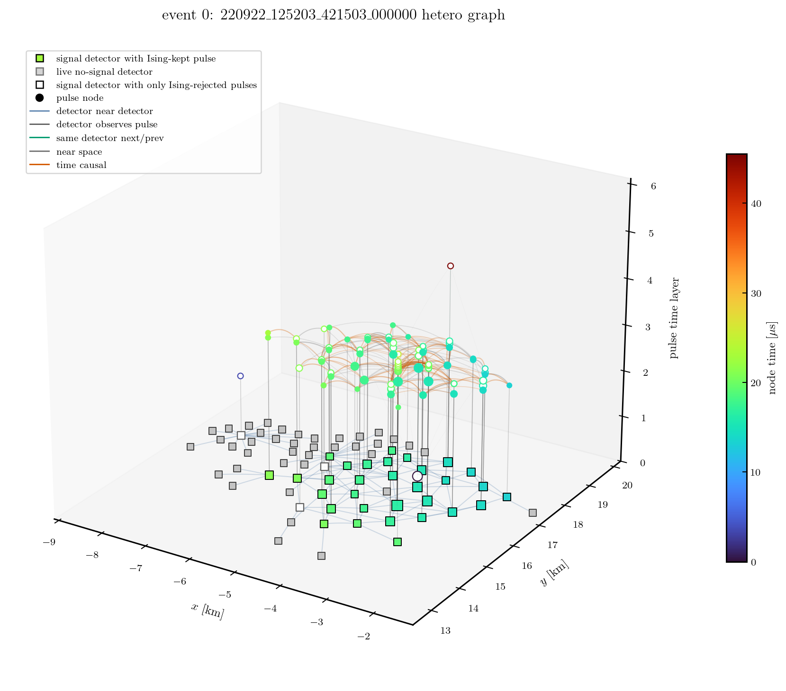
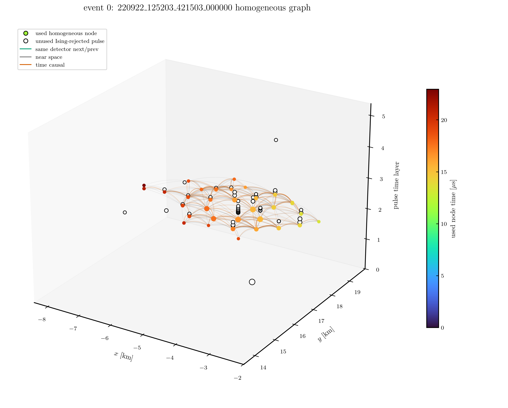
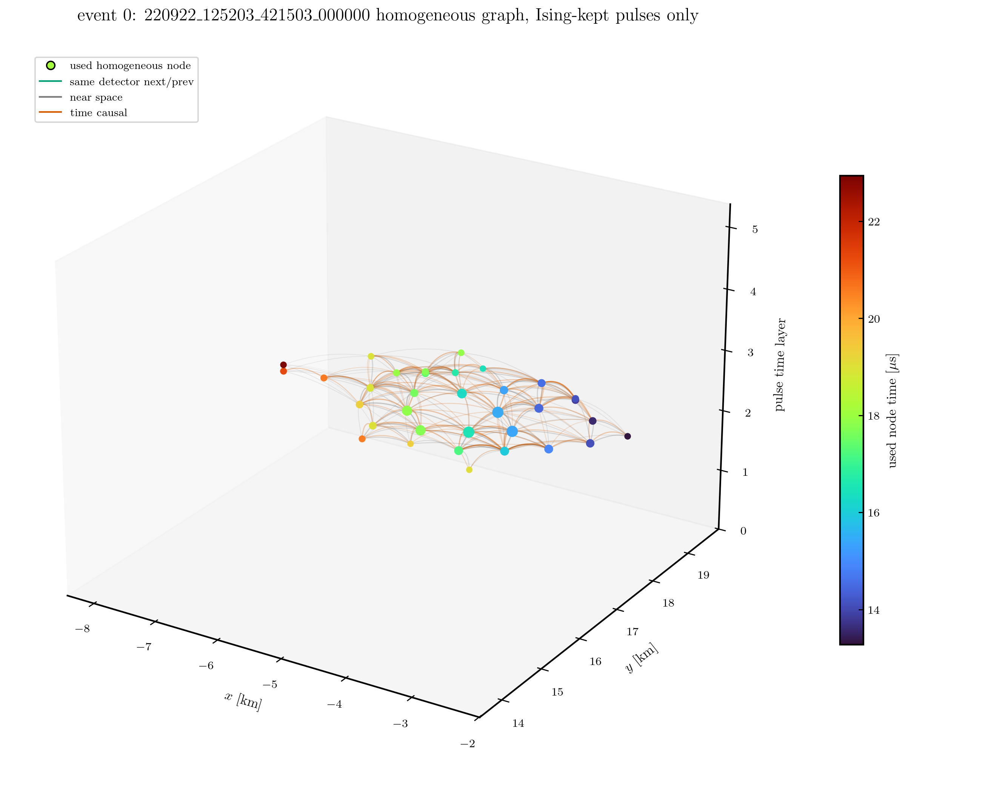

Heterogeneous DST Reconstruction Workflow
=========================================

The heterogeneous path is the current path for training a model that can later reconstruct DST files directly.
It uses ``dstio.tale.graph`` for graph semantics and HDF5 export.
The GNN repository is responsible for CLI orchestration, HDF5 reading, model input conversion, training, diagnostics, and direct inference.

For the model internals, read :doc:`hetero_model`.
That page follows the PyTorch and PyG documentation style and explains the actual tensors, encoders, relation attention, readout, loss heads, and direct inference path used in this repository.

The first figure is the workflow diagram. It separates the HDF5 training-cache path from the direct DST reconstruction path.

.. figure:: ../fig/hetero_dst_workflow.svg
   :alt: Heterogeneous TALE-SD graph workflow from DST to training cache and direct reconstruction.
   :width: 100%

   Detector waveforms are stored once on detector nodes. Pulse nodes keep ``pulse_detector_index`` and ``pulse_bounds`` so the model can relate each pulse to the detector waveform without duplicating that waveform.

Graph schema
------------

The next figure is a real event display made from a ``GraphEvent`` in the
diagnostic notebook. It is useful to look at this before reading the abstract
schema diagram, because it shows what detector nodes, pulse nodes, and typed
edges look like in one event.

   Example heterogeneous event graph. Square markers are detector nodes at the
   detector positions. Filled signal-detector squares have at least one
   Ising-kept pulse. Gray squares are live no-signal detector nodes. Open
   detector squares have only Ising-rejected pulse candidates. Round markers are
   pulse nodes placed above their detector on the pulse-time layer. Blue edges
   are detector--detector proximity relations, gray vertical edges connect a
   detector to its pulse nodes, green edges connect consecutive pulses on the
   same detector, gray pulse--pulse edges are near-space relations, and orange
   pulse--pulse edges are the time-causal subset.

The next display uses the same DATA event and the same plotting style, but
shows the homogeneous pulse graph view. Detector nodes, detector--detector
edges, and detector--pulse edges are omitted. Only used pulse nodes and
pulse--pulse relations are colored. Ising-rejected pulse candidates that are
not used by this homogeneous view are shown as white circles with black
outlines, so they do not affect the time colorbar.

   Homogeneous pulse-graph comparison view of the same DATA event. The colorbar
   is normalized only by the used pulse nodes. Unused rejected pulse candidates
   remain visible as white circles with black outlines.

The next view removes Ising-rejected pulse candidates from the display
entirely.  For the homogeneous-from-hetero comparison run using
``PULSE_MASK=ising_kept``, this is the view that matches the pulse nodes and
pulse--pulse edges used by training.

   Homogeneous pulse graph with only Ising-kept pulse nodes drawn. Rejected
   pulse nodes and edges attached to them are not shown.

The schema diagram below shows the same information in a simplified graph form.
It shows the actual node and edge types used inside one ``GraphEvent``.
Detector nodes and pulse nodes are different node types.
Detector waveforms are stored on detector nodes once, and pulse nodes refer to a waveform segment using ``pulse_detector_index`` and ``pulse_bounds``.
Both Ising-kept and Ising-rejected pulse candidates remain present in the ML graph.

.. figure:: ../fig/hetero_graph_schema.svg
   :alt: Heterogeneous TALE-SD graph schema with detector nodes, pulse nodes, typed edges, detector waveforms, pulse bounds, and Ising kept/rejected pulse candidates.
   :width: 100%

   Detector-detector, pulse-pulse, and detector-pulse relations are separate edge types. Ising-rejected pulse candidates are annotated and kept as input rather than hard-dropped.

``dstio.tale.graph.iter_graphs`` emits ``GraphEvent`` objects using
``tale_sd_hetero_ising_pulse_detector_graph_v3``.
The default ML graph policy is ``node_policy="all_candidates_with_ising"``:
Ising-rejected pulse candidates remain in the graph and carry Ising annotation features.
Use ``node_policy="ising_kept"`` only for reconstruction-cleaned subsets.

The node and relation types are:

.. list-table::
   :header-rows: 1

   * - Type
     - Stored fields
   * - Detector node
     - ``detector_features``, ``detector_context_features``, ``detector_positions_km``, ``detector_lids``, ``detector_waveforms``
   * - Pulse node
     - ``pulse_features``, ``pulse_positions_km``, ``pulse_lids``, ``pulse_detector_index``, ``pulse_bounds``
   * - Relations
     - ``pulse__same_detector_next__pulse``, ``pulse__same_detector_prev__pulse``, ``pulse__near_space__pulse``, ``pulse__time_causal__pulse``, ``detector__near__detector``, ``detector__observes__pulse``, ``pulse__observed_by__detector``

In the v3 schema, ``pulse__time_causal__pulse`` is not a loose all-distance
compatible-pair relation. It is the near-space subset with
``distance <= 1.5 km``, ``abs(dt) <= distance / c + 2 FADC bins``, and Ising
``raw_weight >= 0.2``. This relation still needs a density check on each new
dataset. The GNN code does not create, reconnect, or remove graph edges; any
relation-definition ablation must be produced by ``dstio`` / ``export-hetero``
as a separate graph dataset.

Schema v3 also adds detector-level Ising summary columns:
``detector_has_ising_kept_pulse``, ``detector_ising_kept_pulse_count``,
and ``detector_ising_removed_pulse_count``. These distinguish a detector with
at least one Ising-kept pulse from a detector that only has Ising-rejected
candidate pulses. The rejected pulse nodes are still kept as ML input.

In the same v3 schema, ``pulse_arrival_usec_rel`` is the pulse node time. It is
computed from the pulse onset, namely the earlier of the upper/lower rise
times, and is measured relative to the first accepted graph pulse candidate in
the event. The time origin is not redefined with the Ising-kept subset, because
Ising-rejected candidates remain in the ML graph.

``detector_trigger_usec_rel`` keeps its historical name for column
compatibility, but its value is the detector node time. With
``cleaning="ising"``, it is the first ``ising_keep = 1`` pulse onset attached to
that detector, expressed on the same ``pulse_arrival_usec_rel`` axis. A detector
with candidate/rejected pulses but no Ising-kept pulse carries
``detector_trigger_usec_rel = 0`` and ``detector_arrival_time_valid = 0``.
It is not the detector waveform start time. When waveform timing is needed, use
``pulse_detector_index`` and ``pulse_bounds`` to relate each pulse to the
detector waveform.

The core-relative pulse features are valid only when the Ising reference core exists.
Training export should therefore use ``--require-reference-core`` unless a separate diagnostic dataset is being made.

Training cache path
-------------------

``export-hetero`` writes HDF5 graph shards for repeated training reads.
This HDF5 is a cache, not the final reconstruction interface.
For balanced MC export, source selection, graphable-event refill, graph construction,
and HDF5 writing are all owned by ``dstio.tale.graph.write_balanced_graph_h5``.
The GNN repository does not reconnect edges or repeat the refill logic.

.. code-block:: text

   DST
     -> talesd-gnn export-hetero
       -> dstio.tale.graph.write_balanced_graph_h5
          or dstio.tale.graph.write_graph_h5
         -> heterogeneous HDF5 shards

``train-hetero`` then reads those shards, fits scalers on the training split, trains the heterogeneous model, and saves a checkpoint.
The default model architecture is ``hetero_attention``: relation-specific multi-head attention over detector/pulse relations plus detector/pulse type-wise attention readout.
It does not use HGSampling; each TALE event remains a full event graph so detector, pulse, waveform, and Ising-rejected pulse information is not sampled away.
The first planned waveform-encoder comparison uses ``WAVEFORM_ENCODER=transformer`` for the six reco+mass size-sweep jobs; ``cnn-gru`` should be compared later under the selected condition.

Direct reconstruction path
--------------------------

``reconstruct-dst`` reads DST files directly and uses the same graph schema and checkpoint scalers as ``train-hetero``.
It does not write an intermediate HDF5 graph.

.. code-block:: text

   DST
     -> talesd-gnn reconstruct-dst
       -> dstio.tale.graph.iter_graphs
         -> hetero_data.sample_to_hetero_data
           -> hetero_attention checkpoint
             -> reconstruction CSV

The direct path is the intended path for large one-pass data and MC reconstruction after the heterogeneous model has been trained.
